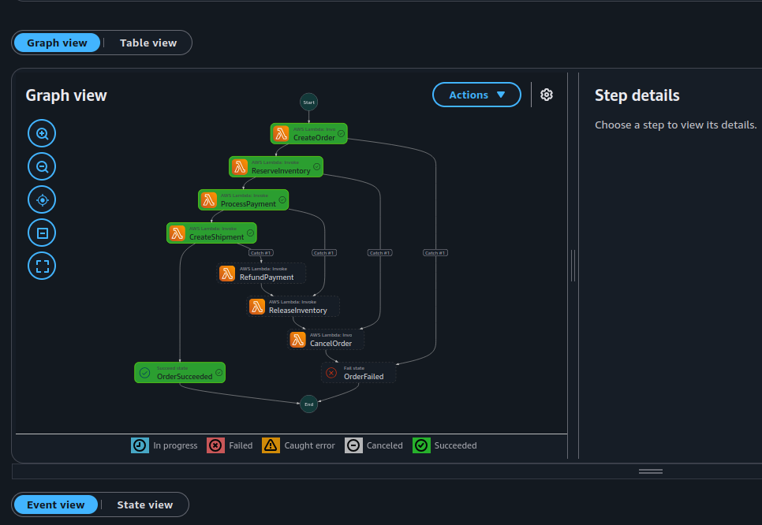
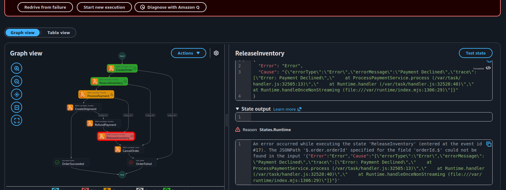

# Order Processing with Saga Orchestration (AWS Serverless)

A production-inspired serverless backend demonstrating the **Saga Orchestration Pattern** using **AWS Step Functions**.

This project simulates an e-commerce order workflow where multiple distributed services collaborate to complete an order. If any service fails, AWS Step Functions automatically executes **compensation transactions** to maintain data consistency.

---

# Architecture

```
                Customer
                    │
                    ▼
              API Gateway
                    │
                    ▼
         Create Order Lambda
                    │
                    ▼
        AWS Step Functions
         (Saga Orchestrator)
                    │
      ┌─────────────┼─────────────┐
      │             │             │
      ▼             ▼             ▼
 Reserve        Process       Create
Inventory       Payment      Shipment
 Lambda          Lambda        Lambda
      │             │             │
      └─────────────┼─────────────┘
                    ▼
           Notify Customer
                    │
                    ▼
              DynamoDB Tables
```

---

# Business Scenario

A customer places an order.

The system must perform the following steps:

1. Create Order
2. Reserve Inventory
3. Process Payment
4. Create Shipment
5. Notify Customer

If any step fails, previously completed steps are rolled back using compensation transactions.

---

# Saga Flow

```
Create Order
      │
      ▼
Reserve Inventory
      │
      ▼
Process Payment
      │
      ▼
Create Shipment
      │
      ▼
Notify Customer
      │
      ▼
Complete Order
```

---

# Compensation Flow

If Payment fails

```
Create Order        ✅

Reserve Inventory   ✅

Process Payment     ❌

↓

Release Inventory

↓

Cancel Order
```

---

If Shipment fails

```
Create Order        ✅

Reserve Inventory   ✅

Process Payment     ✅

Create Shipment     ❌

↓

Refund Payment

↓

Release Inventory

↓

Cancel Order
```

Compensation always executes in **reverse order**.

---

# Tech Stack

- AWS API Gateway
- AWS Lambda (Node.js + TypeScript)
- AWS Step Functions
- Amazon DynamoDB
- Amazon EventBridge (Optional)
- Amazon CloudWatch
- AWS SAM (Deployment)

---

# Project Structure

```
order-saga/

├── infrastructure/
│   ├── iam/
│   ├── sam-template.yaml
│   └── step-functions.json
│
├── lambdas/
│   ├── create-order/
│   ├── cancel-order/
│   ├── reserve-inventory/
│   ├── release-inventory/
│   ├── process-payment/
│   ├── refund-payment/
│   ├── create-shipment/
│   ├── cancel-shipment/
│   └── notify-customer/
│
├── shared/
│   ├── constants.ts
│   ├── dynamodb.ts
│   ├── logger.ts
│   ├── response.ts
│   └── types.ts
│
├── events/
│   └── sample-order.json
│
└── README.md
```

---

# DynamoDB Tables

## Orders

Stores customer orders.

```
PK : orderId
```

Attributes

- customerId
- amount
- status
- createdAt

---

## Inventory

Stores available product stock.

```
PK : productId
```

Attributes

- stock

---

## Payments

Stores payment information.

```
PK : paymentId
```

Attributes

- orderId
- amount
- status

---

## Shipments

Stores shipment details.

```
PK : shipmentId
```

Attributes

- orderId
- status

---

# Lambda Functions

## Create Order

- Validate request
- Create order
- Set status to PENDING

---

## Cancel Order

Compensation for Create Order.

---

## Reserve Inventory

- Verify stock
- Reserve inventory

Compensation

- Release Inventory

---

## Release Inventory

Compensation transaction.

---

## Process Payment

- Charge customer
- Store payment record

Compensation

- Refund Payment

---

## Refund Payment

Compensation transaction.

---

## Create Shipment

- Create shipment
- Store shipment details

Compensation

- Cancel Shipment

---

## Cancel Shipment

Compensation transaction.

---

## Notify Customer

- Email
- SMS
- Push Notification

---

# Step Functions Responsibilities

- Orchestrate workflow
- Retry transient failures
- Trigger compensating transactions
- Record execution history
- Maintain workflow state

---

# Logging

CloudWatch captures

- Request
- Response
- Execution Time
- Errors
- Order ID

---

# Future Improvements

- EventBridge integration
- SQS + DLQ
- Idempotency
- X-Ray tracing
- CloudWatch Dashboard
- Retry with Exponential Backoff
- SNS notifications
- Authentication using Cognito
- Infrastructure as Code improvements

---

# Learning Objectives

After completing this project you will understand

- Saga Orchestration
- Distributed Transactions
- Compensation Transactions
- AWS Step Functions
- Lambda Integration
- DynamoDB Design
- Serverless Architecture
- Event Driven Architecture
- Production Error Handling
- Cloud Monitoring

# Images of Execution:

### Happy Path


### Payment Failure
